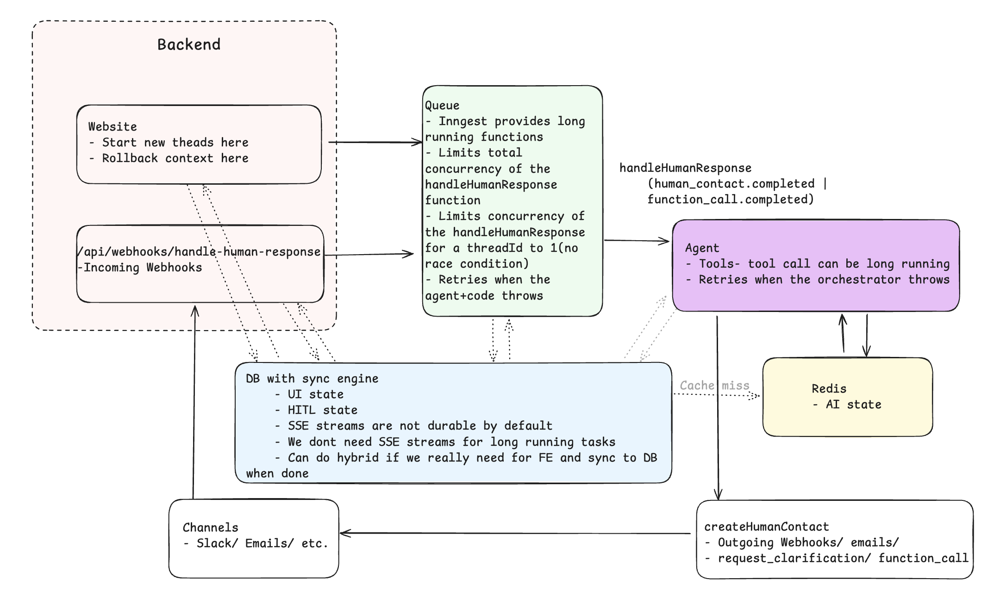

# HITL: GH agent

HITL powered github agent that can search/ create and update issues
- Use these credentials for the hosted app - HITL/ retries/ etc
    ```
    samirsharma.iitd@gmail.com
    12345678
    ```
- Watch the demo: https://www.loom.com/share/f177184a1c9a4f2d973b3b29430d2bbc?sid=43ef6ca1-4845-4176-9440-b066781addfe
- How I thought about the project: https://www.loom.com/share/d066ae8209414415a77c671167b7aa6d?sid=32cb526f-2534-41e9-8df6-66e78670c8c2 

## System design


## Approach
State management
- AI State/ Context - In-memory/ Redis(in general keys/ values are not durable)
    - Manage ai intents only and frequently read/ edited by the orchestrator
- UI State - DB
    - Like git commit graph -  tree of events/ nested events
    - We always append to this/ update the last event
- HITL state - DB/ Redis - Not implemented
    - Stores clarification_requests

- Tradeoffs
  - When the agent is working/ using tools, the ui state will lag behind, 
  - When the task is sent the ai state will lag,
  - We can always generate the AI state using the UI state
      - Kept simple and choose certain event types from UI state
      - Important for rollback(PS: Only the JSON rollback works in the FE for now)


- I modelled the data in a simple thread>event method where the specific shape of the data will be defined by the agent/ orchestrator. Here are the data shapes/ type for our GH agent
```
Thread
    metadata: any
    events: Event[]

Event
    type: 
    data: any

# Event is typed for BE/ FE but not for the DB

AI State/ Intent =  
    | ClarificationRequest
    | DoneForNow
    | NothingToDo
    | Await
    | IntentCreateTicket
    | IntentSearchGitHub
    | IntentUpdateGitHubIssue
    | IntentCommentOnIssue
    | IntentLinkIssues

UI State = 
    | ThreadCreatedEvent                
    | HumanResponseEvent                
    | RequestMoreInformationEvent
    | UserMessageEvent                
    | AIResponseEvent                
    | AssistantMessageEvent                
    | ErrorEvent                
    | WebhookReceivedEvent                
    | WebhookOperationEvent                
    | QueueEvent                        
    | AIStepEvent                
    | ToolCallEvent                
    | FunctionCallEvent                
    | WebhookProcessedEvent                
    | CalculateIntentEvent                                
    | SearchGitHubIntentEvent                
    | UpdateGitHubIssueIntentEvent                
    | CommentOnIssueIntentEvent                
    | LinkIssuesIntentEvent                
    | DoneForNowIntentEvent                
    | NothingToDoIntentEvent                
    | HumanContactSentEvent                
    | CalculateResultEvent                
    | GitHubSearchResultEvent                
    | RollbackAgentEvent                
    | GenericEvent

```

Agentic system/ Orchestrator
- Context 
    - Pass XML not json
    - If errors are fixed they are removed from the context
    - Allow markdown output with backticks rather than escapes \n
    - Everything is a tool(Human response/ outreach, etc) so the agent does not have to think about string vs tool calls
    - We want to compact to 25% whenever we reach 40%(Also redis per unit storage limit forces us to think about this) - Not implemented
- Tools
    - Humans are tools
    - Other agents are also tools
    - GH tools
        - Create/ Update has approvals
        - Read/ Search
    - Escapes(await/ done_for_now(human contact)/ nothing_to_do)

Human contact
- Static Approve/ Deny/ Custom feedback buttons
- Static UI based on already known types
- Dynamic schema at runtime and the UI based on the schema - Not implemented

## File structure

```
hitl-that-works/
├── apps/
│   └── web/
│       └── src/
│           ├── app/
│           │   ├── api/
│           │   │   ├── redis/[stateId]/route.ts    # Polling - get/set
│           │   │   ├── thread/send-message/route.ts    # Frontend - auth
│           │   │   └── webhooks/human-response/route.ts    # Incoming webhooks
│           │   ├── dashboard/page
│           │   │   └── threads/[id]/page.tsx
│           │   ├── page.tsx  # Home
│           ├── components/
│           │   ├── ai-elements/
│           │   ├── event-chain/
│           │   │   ├── parts/
│           │   │   ├── EventFilter
│           │   │   └── page.tsx
│           │   ├── ui/
│           │   ├── message-input.tsx
│           │   └── redis-state-{editor,modal,panel}.tsx
│           ├── inngest/functions/*
│           └── lib/
│               ├── message-processing.ts
│               ├── utils.ts
│               └── webhook.ts
├── packages/
│   ├── backend/
│   │   └── convex/
│   │       ├── schema.ts
│   │       └── threads.ts
│   └── ai/
│       └── src/
│           ├── agent.ts
│           ├── functions.ts
│           ├── index.ts
│           ├── tools/
│           │   ├── github.ts
│           │   └── calculator.ts
│           ├── contact/
│           │   ├── index.ts
│           │   ├── schemas.ts
│           │   ├── types.ts
│           │   └── channels/
│           │       ├── email.ts
│           │       ├── slack.ts
│           │       └── webhook.ts
│           ├── schemas/
│           │   ├── thread.ts
│           │   ├── email.ts
│           │   ├── human-contact.ts
│           │   ├── webhook.ts
│           │   └── index.ts
│           ├── state.ts
│           ├── queue.ts
│           ├── db.ts
│           ├── sync.ts
│           ├── utils.ts
│           └── baml_client/
│               ├── config.ts
│               ├── types.ts
│               └── react/
│                   └── ... (other files)
├── pnpm-workspace.yaml
├── turbo.json
└── biome.json
```

## Prerequisites

- pnpm
- Node 20+
- Copy `env.example` to `.env` and fill values

## Local setup

- Run the local inngest server during development
- Fill per package env during development
- Set google auth token on the convex environment

Develop
```bash
pnpm install
pnpm dev:setup              # one-time Convex configuration
pnpm dev
pnpm inngest:dev
```
Deploy

```bash
pnpm check
pnpm check-types
pnpm build
```
